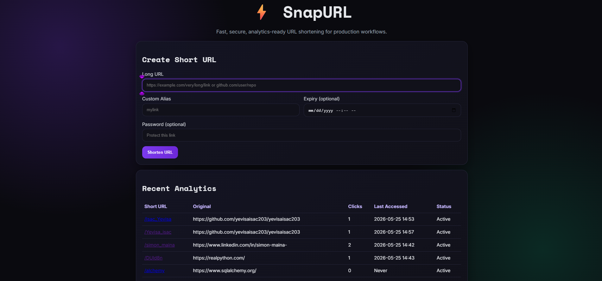
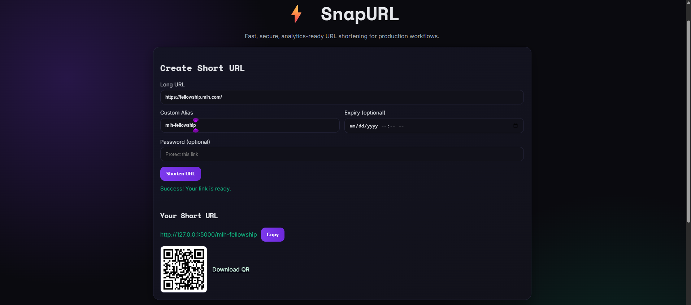

# SnapURL - Production URL Shortener


SnapURL is a production-grade Flask URL shortener with analytics, QR generation, password protection, expiry controls, custom aliases, bulk APIs, and a polished dark-themed dashboard.

## Features

- ⚡ Fast 6-character short-code generation with collision safety
- 🔐 Optional password-protected short links
- 🧩 Custom alias support (e.g. `/mylink`)
- 📅 Optional per-link expiry timestamps
- 📈 Click analytics (`click_count`, `last_accessed_at`)
- 🔍 Preview endpoint before redirect
- 📦 Bulk URL shortening API
- 🧾 JSON-first API responses with descriptive errors
- 🚦 Per-IP rate limiting (`10 requests/minute`) on shorten endpoints
- 🧠 Auto-seeded sample data for first-run dashboard richness
- 🎨 Custom dark responsive UI with QR display and copy-to-clipboard

## Project Structure

```text
task1_url_shortener/
├── app/
│   ├── __init__.py
│   ├── models.py
│   ├── routes.py
│   ├── utils.py
│   ├── static/
│   │   └── css/
│   │       └── style.css
│   └── templates/
│       ├── base.html
│       └── index.html
├── config.py
├── run.py
├── requirements.txt
├── .env.example
└── README.md
```

## Installation

1. Clone and enter the project:
```bash
git clone <your-repo-url>
cd task1_url_shortener
```
2. Create and activate virtualenv:
```bash
python -m venv .venv
# Windows:
.venv\Scripts\activate
# Linux/macOS:
source .venv/bin/activate
```
3. Install dependencies:
```bash
pip install -r requirements.txt
```
4. Configure environment:
```bash
copy .env.example .env
```
5. Run the server:
```bash
python run.py
```

App will be available at `http://127.0.0.1:5000`.

## Environment Variables

| Variable | Description | Default |
|---|---|---|
| `FLASK_ENV` | Runtime environment (`development` or `production`) | `development` |
| `SECRET_KEY` | Flask secret key | `dev-secret-key-change-me` |
| `DATABASE_URL` | SQLAlchemy DB URI | `sqlite:///snapurl.db` |
| `SHORT_CODE_LENGTH` | Length of generated short code | `6` |
| `DEFAULT_LINK_EXPIRY_DAYS` | Optional default expiry window | `0` |

## API Documentation

| Endpoint | Method | Description | Request Body | Response |
|---|---|---|---|---|
| `/api/shorten` | POST | Shorten one URL | `{"url":"https://...","custom_alias":"mylink","expires_at":"2026-12-01T10:00:00Z","password":"secret"}` | `201` with short URL, metadata, QR URL |
| `/api/shorten/bulk` | POST | Shorten multiple URLs | `{"urls":[{"url":"https://a.com"},"https://b.com"]}` | `201` array with per-item success/failure |
| `/api/links?limit=10` | GET | List recent links and analytics | None | `200` list of links |
| `/preview/<short_code>` | GET | Preview metadata before redirect | None | `200` metadata payload |
| `/<short_code>` | GET | Redirect to original URL (301); logs click | Optional `?password=...` for protected links | `301` redirect or JSON error |
| `/qrcodes/<filename>` | GET | Serve generated QR image file | None | `200` PNG |

## Screenshots

### Dashboard UI


### Created URL + QR


### Mobile View


## Notes

- On first run, the app creates sample URLs automatically for demo analytics.
- SQLite is used for development. For production, switch `DATABASE_URL` to a managed database.
- `Flask-Migrate` is included and initialized via the app factory.

## License

MIT License
